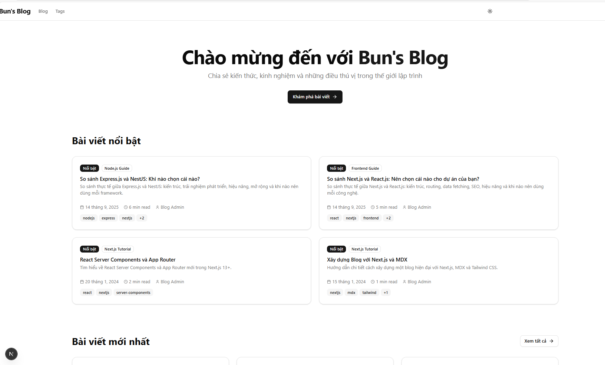
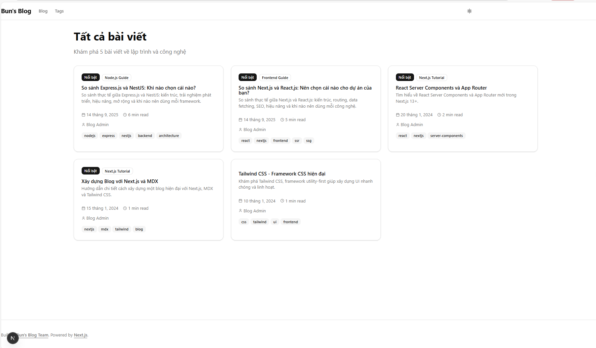
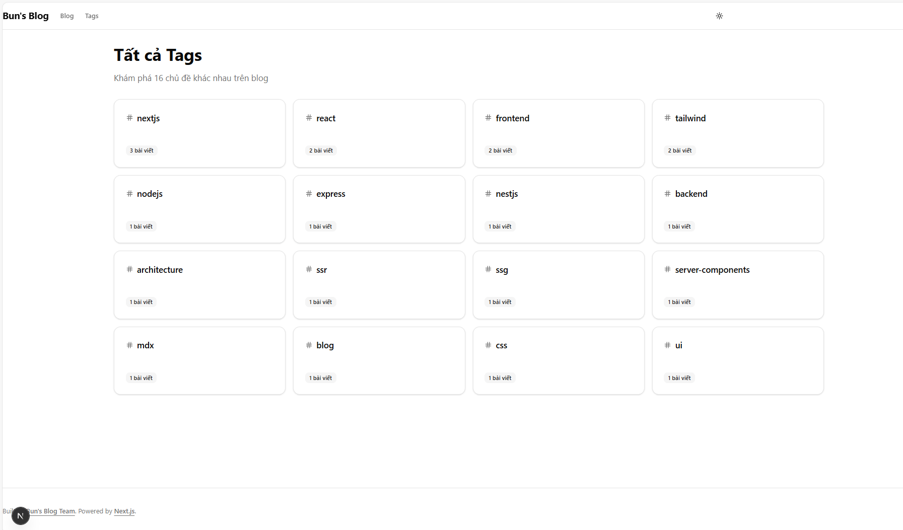

# Bun's Blog

A modern, minimalist, and fast personal blog built with Next.js, MDX, and TailwindCSS. Bun's Blog is designed for developers and creators who want a beautiful, performant, and easy-to-maintain blog platform.



## ✨ Features

- **Next.js App Router**: Fast, scalable, and SEO-friendly architecture
- **MDX Content**: Write posts in Markdown + JSX for rich, interactive articles
- **Dynamic Tags & Feed**: Organize posts by tags and provide an RSS feed
- **Dark/Light Theme**: Toggle between beautiful dark and light modes
- **Responsive Design**: Works perfectly on all devices
- **Modern UI**: Custom components, cards, and avatars
- **SEO Optimized**: Sitemap, robots.txt, and meta tags
- **Fast Build**: Powered by Bun and Turbopack

## 🗂️ Project Structure

```
buns-blog/
├── app/           # Next.js app directory (pages, layout, routing)
├── components/    # UI and layout components
├── content/       # MDX blog posts
├── lib/           # Utilities and MDX config
├── public/        # Static assets (SVGs, images)
├── resources/     # Page screenshots and illustrations
├── .next/         # Build output (auto-generated)
├── ...            # Config files
```

## 📸 Screenshots

### Home Page


### Blog Listing


### Tags Page


## 🚀 Getting Started

1. **Install dependencies**
	```bash
	bun install
	```
2. **Run the development server**
	```bash
	bun run dev
	```
3. **Build for production**
	```bash
	bun run build
	```
4. **Visit your site**
	Open [http://localhost:3000](http://localhost:3000) in your browser.

## 📝 Writing Posts

- Add `.mdx` files to `content/posts/`.
- Use frontmatter for metadata (title, date, tags).
- Supports Markdown, React components, and code blocks.

## 🛠️ Customization

- Edit `components/` for custom UI
- Update `app/layout.tsx` for global layout
- Add new pages in `app/`
- Change theme colors in `app/globals.css`

## 📦 Technologies Used

- [Next.js](https://nextjs.org/) (App Router)
- [MDX](https://mdxjs.com/)
- [TailwindCSS](https://tailwindcss.com/)
- [Bun](https://bun.sh/)
- [TypeScript](https://www.typescriptlang.org/)

## 📄 License

MIT License. Free for personal and commercial use.

---

> Made with ❤️ by NguyettNhu
